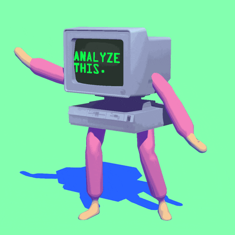

 

   <h1>< Hello World!🚀 /></h1>
   <h2>nameDeveloper === "Gustavo Henrique";</h2>

 <!---->
 

### 👾 About me
My name is Gustavo, I'm Brazilian and I'm a programming aficionado.
I am an obstinate person who always seeks more and more challenges, seeking excellence and bringing greater value to what I do.
I try to focus on being a FullStack Developer 🐱‍💻 (having knowledge in both front-end and back-end technologies)
and looking to venture into mobile yet.

### 🌟 Favorite quote:
  “Programadores e artistas são os únicos profissionais que tem como hobby a própria profissão.” – Rafael Lain

### 🎯 Areas of Interest
- Develop. FullStack
- Develop. Mobile
- Develop. de Sistemas
- Web Design - UX & UI

### ✍️ Studying Recently
  -  Bootstrap && JQuery && ReactJS e Native && Sass;

### 📚 Upcoming studies:
  -  Angular && PHP (with Laravel) && Vue && Node (with Express)
  
  

### 🛠 Skills and Tools

<kbd>
  <kbd>📌 My Skills</kbd>
   
   
  
  
  
  
  
  
  
  
  
  
 
  <!--    -->
</kbd>
 
   
  
<kbd>
  <kbd>📌 Tools</kbd>
   
   
  
  
  
  
  
</kbd>

### 👔 Soft skills

✅ Work collaboratively in a team

✅ Meet tight deadlines

✅ Good communication skills

✅ Proactive

✅ Obstinate 

✅ High problem-solving skills

 ## 📬 If you want to call me to carry out a project or just talk, these are my contacts:
  

    
    &nbsp;&nbsp;&nbsp;&nbsp;&nbsp;&nbsp;&nbsp;&nbsp;&nbsp;
    
    &nbsp;&nbsp;&nbsp;&nbsp;&nbsp;&nbsp;&nbsp;&nbsp;&nbsp;
    

## 📈 Github Stats
  
<a href="https://github.com/SubhamRaoniar28/github-readme-stats"> &nbsp;</a>
  
 

 ### Total de visitas no meu perfil 
 
 
   
 

  

