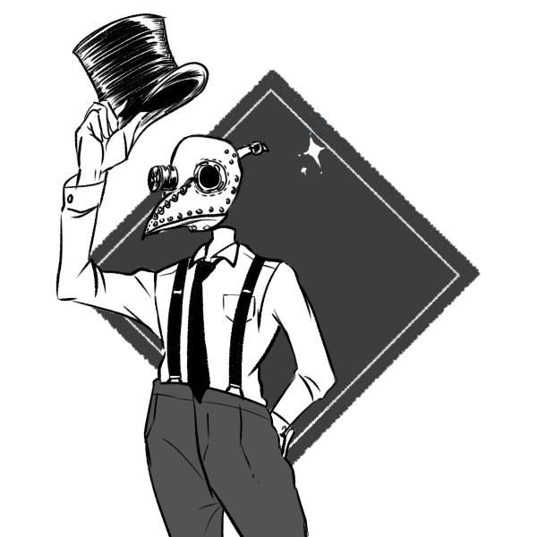
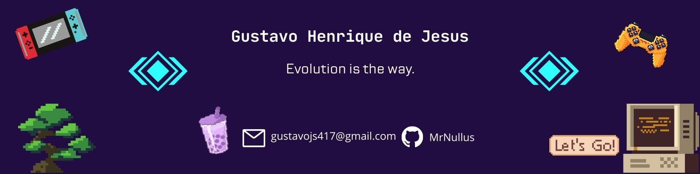

 
<div align="center">
 <h1>< Hello World!🚀 /></h1>
</div>

 <!---->
 


## Hi there!  I'm Gustavo, a Brazilian 🇧🇷 programming enthusiast.

**Determined to become a Full Stack Developer ,** I'm eager to master front-end and back-end technologies, as well as mobile development .

**Passionate about creating user-friendly and visually appealing applications,** I love working in collaborative environments  where I can contribute my ideas and learn from others.

**Always seeking new challenges and striving for excellence,** I believe in continuous learning  and keeping up with the latest trends in the programming world .

**Problem-solving, critical thinking, and attention to detail** are my superpowers  that allow me to analyze complex situations and come up with effective solutions.

**I'm excited to work on innovative projects and contribute to the ever-evolving world of technology.** Let's connect and create something amazing together! ✨

**Feel free to reach out for any collaboration or programming-related discussions.** 

**Let's code!** 
              
</center>

### 🌟 Favorite quote:
  “Programadores e artistas são os únicos profissionais que tem como hobby a própria profissão.” – Rafael Lain


### 🎯 Areas of Interest
- Full Stack Developer
- FrontEnd Developer
- BackEnd Developer
- Mobile Developer
- Web Design


### ✍️ Studying Recently
  -  Test (Jest, Cypress, etc) && CI/CD && Redux && Ruby on Rails;


### 📚 Upcoming studies:
  -  AWS Services && Big O Notation && Clean Arch


<br />
<hr>


### 🛠 Hard Skills and Tools


<details>
 <summary>Click to see details</summary>
 <br />      

<kbd>
  <kbd>📌</kbd>
  <br>
  <br>
  
  
  
  
  
  
  
  
  
  


 
  <!--    -->
</kbd>
<br>
<br>  
  
<kbd>
  <kbd>📌 Tools</kbd>
  <br>
  <br>
  
  
  
  
  
</kbd>
</details>
<br />

### 👔 Soft Skills

<details>
 <summary>Click to see details</summary>
 <br />      

✅ Work collaboratively in a team

✅ Meet tight deadlines

✅ Good communication skills

✅ Proactive

✅ Obstinate 

✅ High problem-solving skills
</details>
<hr>
<br/ >


 ## 📬 If you want to call me to carry out a project or just talk, these are my contacts:

<details>
 <summary>Click to see details</summary>
 <br />      
       
 <p align="center">
    <a href="https://github.com/dev-gustavo-henrique">
        
    </a>
    &nbsp;&nbsp;&nbsp;&nbsp;&nbsp;&nbsp;&nbsp;&nbsp;&nbsp;
    <a href="mailto:gustavojs417@gmail.com">
        
    </a>
    &nbsp;&nbsp;&nbsp;&nbsp;&nbsp;&nbsp;&nbsp;&nbsp;&nbsp;
    <a href="https://www.linkedin.com/in/dev-gustavo-henrique">
        
    </a>
  
  ```diff
            |    |              _.-7
            |\.-.|             ( ,(_
            | a a|              \\  \,
            ) ["||          _.--' \  \\
         .-'  '-''-..____.-'    ___)  )\
        F   _/-``-.__;-.-.--`--' . .' \_L_
       |   l  {~~} ,_\  '.'.      ` __.' )\
       (    -.;___,;  | '- _       :__.'( /
       | -.__ _/_.'.-'      '-._ .'      \\
       |     .'   |  -- _                 '\,
       |  \ /--,--{ .    '---.__.       .'  .'
       J  ;/ __;__]. '.-.            .-' )_/
       J  (-.     '\'. '. '-._.-.-'--._ /
       |  |  '. .' | \'. '.    ._       \
       |   \   T   |  \  '. '._  '-._    '.
       F   J   |   |  '.    .  '._   '-,_.--`
       F   \   \   F .  \    '.   '.  /
      J     \  |  J   \  '.   '.    '/
      J      '.L__|    .   \    '    |
      |   .    \  |     \   '.   '. /
      |    '    '.|      |    ,-.  (
      F   | ' ___  ',._   .  /   '. \
      F   (.'`|| (-._\ '.  \-      '-\
      \ .-'  ( L `._ '\ '._ (
 snd  /'  |  /  '-._\      ''\
          `-'
  ```

  
</p>
</details>
<br />


## Holopin 🐱‍🐉

<details>
 <summary>Click to see details</summary>
 <br />      
       
 [](https://holopin.io/@mrnullus)
</details>
<br />


## 🏆 Trophies 

<details>
 <summary>Click to see details</summary>
 <br />      
       
 

</details>
<br />

## 📈 Github Stats
  
<details>
 <summary>Click to see details</summary>
 <br />      
  
<p align="center">
     
   
<br>

</img> 
</details>
<br>
 
 ## 🌟 Total visits to my profile
 <details>
 <summary>Click to see details</summary>
  <br />      
  <p align="center"> 
    
    <br>
    
  </br>
  </p>
 </details>
 
  <br/>
  
<!--
## 😎 3D Contribution 
   

<a href="http://www.github.com/msNullus"></a>
-->


<!--🤖ASCIIART / 🌐WEBSITES: https://asciiart.website/ & https://github.com/github/markup/issues/1440#issuecomment-803889380 -->
<div align="center">

 
<!--   

+@ @ @ @ @ @ @ @ @ @ @ @ @ @ @ @ @ @ @ @ @ @ @ @ @ @ @ @+
@@       o o                                           @@
@@       | |                                           @@
@@      _L_L_                                          @@
@@   ❮\/__-__\/❯ Programming isn't about what you know @@
@@   ❮(|~o.o~|)❯  It's about what you can figure out   @@
@@   ❮/ \`-'/ \❯                                       @@
@@     _/`U'\_                                         @@
@@    ( .   . )     .----------------------------.     @@
@@   / /     \ \    | while( ! (succed=try() ) ) |     @@
@@   \ |  ,  | /    '----------------------------'     @@
@@    \|=====|/                                        @@
@@     |_.^._|                                         @@
@@     | |"| |                                         @@
@@     ( ) ( )   Testing leads to failure              @@
@@     |_| |_|   and failure leads to understanding    @@
@@ _.-' _j L_ '-._                                     @@
@@(___.'     '.___)                                    @@
+@ @ @ @ @ @ @ @ @ @ @ @ @ @ @ @ @ @ @ @ @ @ @ @ @ @ @ @+
-->
 
 
```bash
    .__________________________.
    | .___________________. |==|
    | | ................. | |  |
    | | ::::Apple ][::::: | |  |
    | | ::::::::::::::::: | |  |
    | | ::::::::::::::::: | |  |
    | | ::::::::::::::::: | |  |
    | | ::::::::::::::::: | |  |
    | | ::::::::::::::::: | | ,|
    | !___________________! |(c|
    !_______________________!__!
   /                            \
  /  [][][][][][][][][][][][][]  \
 /  [][][][][][][][][][][][][][]  \
(  [][][][][____________][][][][]  )
 \ ------------------------------ /
  \______________________________/
```  

 
 

</div>

